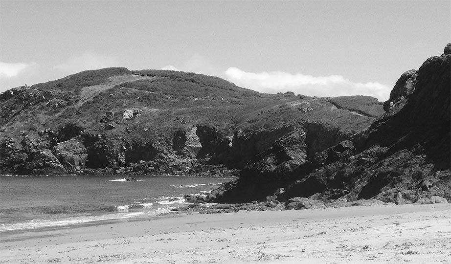

<br>
<p align="center">
  
</p>
<h1 align="center"><a href="http://bretagnebretagne.fr">bretagnebretagne.fr</a></h1>
<h3 align="center">Website of Bretagne, the type foundry of Lucas Le Bihan</h3>

<br><br>
<br><br>

### Installation

```sh
git clone https://github.com/pqml/bretagne
cd bretagne
npm install
```

<br>
<h1></h1>
<br>

### Usage
<br>

#### `npm run start`
Run the development server.

#### `npm run build`
Compile a production-ready build into the dist folder.

#### `npm run build:serve`
Serve and test the current compiled website before deployment.

<br>
<h1></h1>
<br>

### Licenses
###### Website
MIT.

###### Fonts
© Copyright 2019 Lucas Le Bihan | Tous droits réservés.

<br><br>
